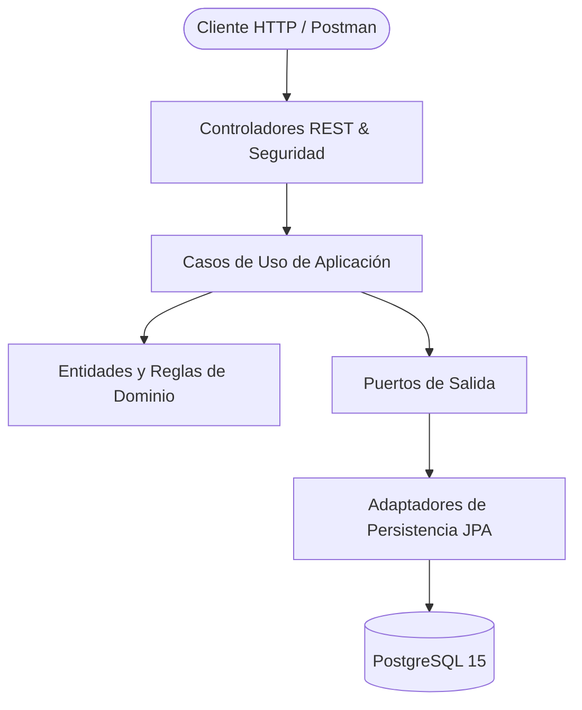
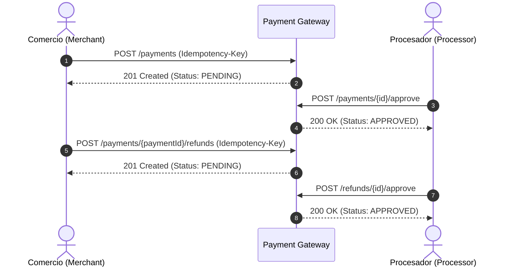

# Payment Gateway API

Backend API desarrollado en **Java 17** y **Spring Boot** que simula las operaciones centrales de una pasarela de pagos bajo los principios de **Clean Architecture (Puertos y Adaptadores)**.

El proyecto implementa el ciclo de vida completo de pagos y reembolsos con autenticación por API Key (roles Merchant y Processor), aislamiento multi-tenant, garantías de idempotencia, control de concurrencia optimista y pesimista, paginación de transacciones y contratos de error uniformes.

---

## Demo

> 🎥 Video demo: próximamente

---

## Highlights

- **Java 17 & Spring Boot** estructurado con Clean Architecture / Ports & Adapters.
- **PostgreSQL & Flyway** para persistencia relacional y migraciones versionadas.
- **Autenticación por API Key** con prefijo indexado y hashing criptográfico SHA-256.
- **Autorización por Roles** diferenciando operaciones de Comercio (`Merchant`) y Procesador (`Processor`).
- **Ciclo de Vida de Pagos y Reembolsos** con máquinas de estado deterministas.
- **Idempotencia Estricta** en peticiones de creación con detección de mutación de payload.
- **Control de Concurrencia** combinando bloqueo optimista (`@Version`) y bloqueo pesimista (`PESSIMISTIC_WRITE`).
- **436 Pruebas Automatizadas** incluyendo unitarias, concurrencia e integración con Testcontainers.

---

## Tech Stack

| Categoría | Tecnología |
|---|---|
| **Lenguaje** | Java 17 (LTS) |
| **Framework** | Spring Boot 4.1.1 (Web, Data JPA, Security, Validation) |
| **Persistencia** | Spring Data JPA / Hibernate |
| **Base de Datos** | PostgreSQL 15 |
| **Migraciones** | Flyway |
| **Seguridad** | Spring Security + SHA-256 Hashing |
| **Testing** | JUnit 5, AssertJ, Mockito, Testcontainers |
| **Herramientas Demo** | Docker Compose, Postman |

---

## Key Features

- **Pagos**: Creación (`PENDING`), consulta por ID, cancelación y operaciones de aprobación/rechazo ejecutadas por un Processor.
- **Reembolsos**: Solicitud de reembolsos parciales o totales sobre pagos aprobados con validación de capacidad y operaciones de aprobación/rechazo por un Processor.
- **Roles y Seguridad**: API Keys independientes para Merchant y Processor con prefijo estructurado.
- **Aislamiento Multi-Tenant**: Consultas restringidas por comercio con respuesta `404` ante accesos cruzados.
- **Idempotencia**: Replays seguros (`201`) y detección de inconsistencias de payload (`409`).
- **Concurrencia**: Bloqueo optimista para transiciones y bloqueo pesimista para reservas de saldo.
- **Paginación**: Historial de pagos y reembolsos mediante paginación offset con orden determinista.
- **Manejo de Errores**: Respuestas JSON estructuradas y consistentes en toda la API.

---

## Arquitectura

El sistema desacopla la lógica de negocio del framework mediante Clean Architecture / Ports & Adapters:



Para un análisis profundo del diseño técnico, consulta las [Notas Técnicas](docs/technical-notes.md).

---

## 5-Minute Demo

Modo interactivo para evaluación rápida en local con actores y credenciales preconfiguradas.

> [!NOTE]
> El perfil `demo` aprovisiona automáticamente 4 identidades (Active/Suspended Merchant, Active/Suspended Processor) y sus credenciales deterministas. Los pagos y reembolsos **no** están precargados para permitir probar el flujo completo desde Postman.

> [!WARNING]
> **SOLO PERFIL DEMO**: Las credenciales del perfil `demo` son públicas y exclusivas para pruebas locales. Nunca deben utilizarse en producción. El perfil por defecto no carga datos demo.

### Prerrequisitos
- **Java 17+** (JDK)
- **Docker & Docker Compose**
- **Git**
- **Postman**

*(El proyecto incluye el Maven Wrapper `./mvnw`, por lo que no requiere instalación global de Maven).*

---

### Pasos de Ejecución

#### 1. Clonar el repositorio
```bash
git clone https://github.com/mcort-sec/payment-gateway.git
cd payment-gateway
```

#### 2. Configurar variables de entorno
Copiar `.env.example` para crear el archivo `.env`:
```bash
cp .env.example .env
```

Cargar las variables en la sesión de terminal para Spring Boot:
- **Linux / macOS / Git Bash**:
  ```bash
  set -a && source .env && set +a
  ```
- **Windows PowerShell**:
  ```powershell
  $env:DB_HOST="localhost"; $env:DB_PORT="5432"; $env:DB_NAME="payment_gateway_db"; $env:DB_USERNAME="payment_gateway_user"; $env:DB_PASSWORD="payment_gateway_secret"
  ```

#### 3. Iniciar PostgreSQL con Docker Compose
```bash
docker compose up -d
```

#### 4. Iniciar la aplicación en perfil demo
- **Linux / macOS**:
  ```bash
  ./mvnw spring-boot:run -Dspring-boot.run.profiles=demo
  ```
- **Windows**:
  ```cmd
  .\mvnw.cmd spring-boot:run -Dspring-boot.run.profiles=demo
  ```

La aplicación iniciará en `http://localhost:8080` e imprimirá el banner de credenciales en consola:

```
================================================================================
PAYMENT GATEWAY — DEMO CREDENTIALS LOADED
================================================================================
[PROFILE: demo] Use these credentials to test the API locally via Postman / cURL.

1. ACTIVE MERCHANT:
   Merchant ID : 00000000-0000-0000-0000-000000000001
   API Key     : pg_test_demoActvMerc_ActiveMerchantDemoSecretKeyForTestingV12345
   Permissions : Create / Get / List Payments, Cancel Payments, Create / Get / List Refunds

2. SUSPENDED MERCHANT:
   Merchant ID : 00000000-0000-0000-0000-000000000002
   API Key     : pg_test_demoSuspMerc_SuspendedMerchantDemoSecretKeyTestingV12345
   Permissions : Get / List resources, Cancel PENDING Payments, Create Refunds; Payment Creation returns 403 Forbidden

3. ACTIVE PROCESSOR:
   Processor ID: 00000000-0000-0000-0000-000000000003
   API Key     : pg_proc_test_demoActvProc_ActiveProcessorDemoSecretKeyForTestingV1234
   Permissions : Approve / Decline Payments and Refunds

4. SUSPENDED PROCESSOR:
   Processor ID: 00000000-0000-0000-0000-000000000004
   API Key     : pg_proc_test_demoSuspProc_SuspendedProcessorDemoSecretKeyTestingV1234
   Permissions : Callback operations return 403 Forbidden
================================================================================
DEMO PROFILE ONLY — NEVER USE THESE CREDENTIALS IN PRODUCTION
================================================================================
```

#### 5. Importar la colección y entorno en Postman
1. Abrir Postman y seleccionar **Import**.
2. Importar los dos archivos ubicados en `postman/`:
   - `postman/payment-gateway.postman_collection.json`
   - `postman/payment-gateway-demo.postman_environment.json`
3. En el selector de entornos (esquina superior derecha), seleccionar **`Payment Gateway Demo Environment`**.

#### 6. Ejecutar el Happy Path
Abrir la carpeta **`01 - Happy Path`** y ejecutar las peticiones en orden:
1. `01 Create Payment — Active Merchant` (Crea pago con monto 5000 USD $\to$ `201 PENDING`).
2. `02 Get Payment — Active Merchant` (Verifica estado `PENDING`).
3. `03 List Payments — Active Merchant` (Verifica presencia en historial paginado).
4. `04 Approve Payment — Active Processor` (Callback aprueba el pago $\to$ `200 APPROVED`).
5. `05 Create Refund — Active Merchant` (Solicita reembolso con monto 2000 $\to$ `201 PENDING`).
6. `06 Get Refund — Active Merchant` (Verifica estado `PENDING`).
7. `07 List Refunds — Active Merchant` (Verifica presencia en historial de reembolsos).
8. `08 Approve Refund — Active Processor` (Callback aprueba el reembolso $\to$ `200 APPROVED`).

---

### Otras carpetas de prueba en Postman
- **`02 - Idempotency`**: Replays con mismo payload (`201`) y detección de cambios de payload (`409 Conflict`).
- **`03 - Security`**: Verificación de errores `401 Unauthorized` y `403 Forbidden` por roles cruzados.
- **`04 - Suspended Actors`**: Bloqueo de creación para comercios suspendidos (`403`) y acceso a lectura (`200`).
- **`05 - Pagination / Validation`**: Validaciones de límites de paginación (`400 Bad Request`).

---

### Resetear base de datos demo
```bash
docker compose down -v
docker compose up -d
```

---

## Flujo de Ejemplo (Happy Path)



---

## Resumen de Endpoints

| Método | Endpoint | Rol Principal | Propósito |
|---|---|---|---|
| `POST` | `/payments` | Merchant | Iniciar un nuevo pago (`PENDING`) |
| `GET` | `/payments` | Merchant | Listar historial paginado de pagos |
| `GET` | `/payments/{id}` | Merchant | Consultar detalle de un pago |
| `POST` | `/payments/{id}/cancel` | Merchant | Cancelar un pago pendiente |
| `POST` | `/payments/{paymentId}/refunds` | Merchant | Solicitar reembolso de un pago aprobado |
| `GET` | `/refunds` | Merchant | Listar historial paginado de reembolsos |
| `GET` | `/refunds/{id}` | Merchant | Consultar detalle de un reembolso |
| `POST` | `/payments/{id}/approve` | Processor | Callback de aprobación de pago |
| `POST` | `/payments/{id}/decline` | Processor | Callback de rechazo de pago |
| `POST` | `/refunds/{id}/approve` | Processor | Callback de aprobación de reembolso |
| `POST` | `/refunds/{id}/decline` | Processor | Callback de rechazo de reembolso |

---

## Testing

La suite incluye 436 pruebas automatizadas (unitarias, concurrencia, seguridad e integración con base de datos PostgreSQL real vía Testcontainers):

```bash
./mvnw test
```

```
[INFO] Tests run: 436, Failures: 0, Errors: 0, Skipped: 0
[INFO] BUILD SUCCESS
```

---

## Estructura del Proyecto

```
payment-gateway/
├── src/main/java/com/miguelcortes/paymentgateway/
│   ├── domain/                  # Entidades, Value Objects y Reglas de Negocio Puras
│   ├── application/             # Casos de Uso, Comandos y Puertos
│   ├── infrastructure/          # Adaptadores JPA, Seguridad, Criptografía y Bootstrap Demo
│   └── entrypoint/              # Controladores REST, DTOs y Manejador Global de Excepciones
├── postman/                     # Colección y Entorno de Postman para pruebas interactivas
├── docs/                        # Documentación técnica detallada
└── compose.yaml                 # Configuración de PostgreSQL local
```

---

## Documentación Adicional

Para más detalles sobre concurrencia, modelo de capacidad, aislamiento tenant y decisiones de diseño, consulta las [Notas Técnicas](docs/technical-notes.md).

---

## Autor

Desarrollado por **Miguel Cortés** ([mcort-sec](https://github.com/mcort-sec)).
